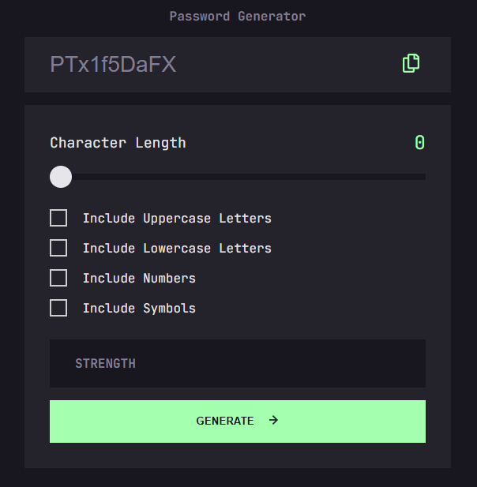

# Frontend Mentor - Password generator app solution

This is a solution to the [Password generator app challenge on Frontend Mentor](https://www.frontendmentor.io/challenges/password-generator-app-Mr8CLycqjh). Frontend Mentor challenges help you improve your coding skills by building realistic projects. 

## Table of contents

- [Overview](#overview)
  - [The challenge](#the-challenge)
  - [Screenshot](#screenshot)
  - [Links](#links)
- [My process](#my-process)
  - [Built with](#built-with)
  - [What I learned](#what-i-learned)
- [Author](#author)

## Overview

### The challenge

Users should be able to:

- Generate a password based on the selected inclusion options
- Copy the generated password to the computer's clipboard
- See a strength rating for their generated password
- View the optimal layout for the interface depending on their device's screen size
- See hover and focus states for all interactive elements on the page

### Screenshot

### Links

- Solution URL: [GitHub](https://github.com/DrakeHermit/password-generator-app)
- Live Site URL: [Live Site](https://drakehermit-random-password.netlify.app/)

## My process

I started building this project by first finishing the markup with HTML and after that I started working on the CSS.
Since I go with the mobile first approach I started styling the generator to look good on mobile phones first and then I did the desktop version.
But as I was working on the JS I revisited both HTML and CSS files to add or remove certain parts.
But the main part of this project was in JS and that took a long time to complete, but nonetheless I learned a lot.

### Built with

- Semantic HTML5 markup
- CSS custom properties
- Flexbox
- Mobile-first workflow

### What I learned

I learned a ton from working on this project, and this was by far the biggest project JS wise for me. I learned how a sorting algorithm works, I also learned how to slice arrays to a given size based on the required amount of characters.

### Continued development

I will keep on learning JS and improve my skills with both HTML and CSS. But my main focus now will be working with objects and different higher order array methods.

## Author

- Frontend Mentor - [@DrakeHermit](https://www.frontendmentor.io/profile/DrakeHermit)